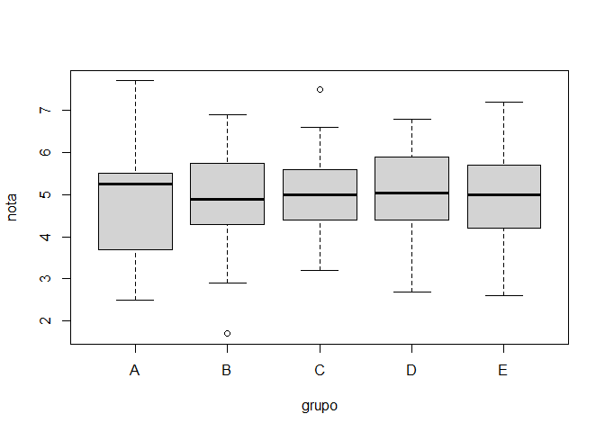
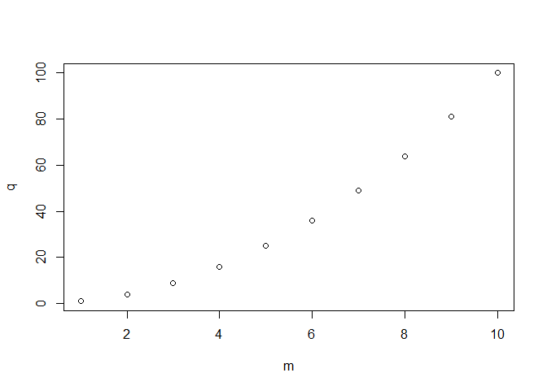

EJERCICIOS
================
Morante_Suarez&Velasquez_Fernandez
18/11/2021

## Parte 01

## Calcula los valores numericos aproximados

### 01 Calcula los valores numericos aproximados

``` r
(0.3*0.15)/(0.3*0.15+0.2*0.8+0.5*0.12)
```

    ## [1] 0.1698113

``` r
(5^6)/factorial(6)*exp(-5)
```

    ## [1] 0.1462228

``` r
choose(20,7)*0.4^7*0.6^13
```

    ## [1] 0.1658823

### 02 Realizar la siguiente suma

``` r
m<-1:1000
sum(m)
```

    ## [1] 500500

``` r
((2^11)-1)/(2-1)
```

    ## [1] 2047

### 03 El vector grupo representa el grupo al que pertenece una serie de alumnos

``` r
load(url("https://goo.gl/uDzU8v"))
```

``` r
"a.¿Cuantos elementos tiene?"
```

    ## [1] "a.¿Cuantos elementos tiene?"

``` r
length(grupo)
```

    ## [1] 192

``` r
"b. ¿En que posiciones del vector esta la letra A"
```

    ## [1] "b. ¿En que posiciones del vector esta la letra A"

``` r
which(grupo=="A")
```

    ##  [1]   2   8  17  21  28  84 101 108 111 115 123 136 190 192

### 04 El vector nota representa la nota de un examen de los alumnos que estan en los grupos del vector grupo

``` r
"a.¿Cuanto suman todas las notas?"
```

    ## [1] "a.¿Cuanto suman todas las notas?"

``` r
sum(nota)
```

    ## [1] 962

``` r
"b. ¿Cual es la media aritmetica de todas las notas?"
```

    ## [1] "b. ¿Cual es la media aritmetica de todas las notas?"

``` r
mean(nota)
```

    ## [1] 5.010417

``` r
"c. ¿En que posiciones estan las notas mayores de 7.0?"
```

    ## [1] "c. ¿En que posiciones estan las notas mayores de 7.0?"

``` r
which(nota>7.0)
```

    ## [1]  81 103 120 151

``` r
"d. Visualiza las notas ordenadas de mayor a menor"
```

    ## [1] "d. Visualiza las notas ordenadas de mayor a menor"

``` r
sort(nota,decreasing=TRUE)
```

    ##   [1] 7.7 7.5 7.4 7.2 7.0 6.9 6.9 6.8 6.8 6.8 6.8 6.8 6.6 6.5 6.4 6.4 6.4 6.4
    ##  [19] 6.3 6.2 6.2 6.2 6.2 6.2 6.2 6.1 6.1 6.1 6.1 6.0 6.0 6.0 6.0 6.0 6.0 5.9
    ##  [37] 5.9 5.9 5.9 5.9 5.9 5.9 5.9 5.9 5.8 5.8 5.8 5.8 5.8 5.7 5.7 5.7 5.7 5.7
    ##  [55] 5.6 5.6 5.6 5.6 5.6 5.6 5.5 5.5 5.5 5.5 5.5 5.5 5.5 5.5 5.5 5.5 5.5 5.5
    ##  [73] 5.5 5.4 5.4 5.4 5.4 5.4 5.4 5.4 5.4 5.3 5.3 5.3 5.3 5.2 5.2 5.2 5.2 5.2
    ##  [91] 5.2 5.2 5.1 5.0 5.0 5.0 5.0 5.0 5.0 5.0 5.0 5.0 4.9 4.9 4.9 4.9 4.9 4.9
    ## [109] 4.8 4.8 4.8 4.8 4.8 4.8 4.7 4.7 4.7 4.7 4.7 4.7 4.7 4.7 4.7 4.7 4.6 4.6
    ## [127] 4.6 4.6 4.5 4.5 4.5 4.5 4.5 4.5 4.4 4.4 4.4 4.4 4.4 4.4 4.4 4.3 4.3 4.3
    ## [145] 4.2 4.2 4.2 4.2 4.2 4.2 4.2 4.2 4.1 4.1 4.1 4.1 4.1 4.0 4.0 4.0 4.0 4.0
    ## [163] 4.0 3.9 3.9 3.8 3.8 3.8 3.7 3.7 3.7 3.7 3.6 3.6 3.6 3.5 3.4 3.4 3.4 3.4
    ## [181] 3.2 3.2 3.2 3.1 3.0 2.9 2.9 2.9 2.7 2.6 2.5 1.7

``` r
"e. ¿En que posicion esta la nota maxima?"
```

    ## [1] "e. ¿En que posicion esta la nota maxima?"

``` r
which(nota==max(nota))
```

    ## [1] 120

### 05 A partir de los vectores grupo y nota definidos

``` r
"a.Suma las notas de los 10 primeros alumnos del vector"
```

    ## [1] "a.Suma las notas de los 10 primeros alumnos del vector"

``` r
grupo_ben=data.frame(grupo,nota)
sum(head(grupo_ben$nota,10))
```

    ## [1] 51.8

``` r
"b.¿Cuantos alumnos hay del grupo C?"
```

    ## [1] "b.¿Cuantos alumnos hay del grupo C?"

``` r
length(grupo[grupo=="C"])
```

    ## [1] 39

``` r
"C.¿Cuantos alumnos han aprobado?"
```

    ## [1] "C.¿Cuantos alumnos han aprobado?"

``` r
length(nota[nota>5])
```

    ## [1] 93

``` r
"d.¿Cuantos alumnos del grupo B han aprobado?"
```

    ## [1] "d.¿Cuantos alumnos del grupo B han aprobado?"

``` r
approved<-which(grupo_ben$grupo=="B"&grupo_ben$nota>5)
length(approved)
```

    ## [1] 10

``` r
"e.¿Que porcentaje de alumnos del grupo C han aprobado?"
```

    ## [1] "e.¿Que porcentaje de alumnos del grupo C han aprobado?"

``` r
which(grupo=="C"&nota>5)
```

    ##  [1]  10  22  23  31  34  50  55  68  70  79  81  91  94 105 118 128 131 147 171
    ## [20] 172 180 191

``` r
length(grupo=="C"&nota>5)
```

    ## [1] 192

``` r
length(which(grupo=="C"&nota>5))
```

    ## [1] 22

``` r
length(which(grupo_ben$grupo=="C"&grupo_ben$nota>5))/length(which(grupo_ben$grupo=="C"))
```

    ## [1] 0.5641026

``` r
"f.¿De que grupos son la maxima y minima notas de toda la muestra?"
```

    ## [1] "f.¿De que grupos son la maxima y minima notas de toda la muestra?"

``` r
which.max(grupo_ben$nota)
```

    ## [1] 120

``` r
grupo_ben$grupo[120]
```

    ## [1] "E"

``` r
which.min(grupo_ben$nota)
```

    ## [1] 142

``` r
grupo_ben$grupo[142]
```

    ## [1] "B"

``` r
"g.Nota media de los alumnos de grupo A y B,juntos,considerando solo a los que han aprobado"
```

    ## [1] "g.Nota media de los alumnos de grupo A y B,juntos,considerando solo a los que han aprobado"

``` r
which(grupo_ben$grupo=="A"&grupo_ben$nota>5)
```

    ## [1]   2  17  28 108

``` r
which(grupo_ben$grupo=="B"&grupo_ben$nota>5)
```

    ##  [1]  13  18  65  86 103 148 170 176 186 187

``` r
notas_A<-nota[c(2,17,28,108)]
notas_B<-nota[c(13,18,65,86,103,148,170,176,186,187)]
notas_C<-nota[c(2,17,28,108,13,65,86,103,148,170,176,186,187)]
mean(notas_C)
```

    ## [1] 5.907692

### 06 Calcula el percentil 66 de las notas de todos los alumnos, y también de los alumnos del grupo C.

``` r
66*length(nota)/100
```

    ## [1] 126.72

``` r
nota_ordenada <- sort(nota)
nota_ordenada -> nota
nota_ordenada[126]      
```

    ## [1] 5.5

``` r
nota_ordenada[127]
```

    ## [1] 5.5

### 07 Un alumno tiene una nota de 4.9. ¿Qué porcentaje, del total de alumnos, tiene una nota menor o igual que la suya? ¿Y qué porcentaje tiene una nota mayor o igual que la suya?

``` r
length(which(nota<=4.9))/length(nota)*100
```

    ## [1] 46.875

``` r
length(which(nota>=4.9))/length(nota)*100
```

    ## [1] 56.25

``` r
which(nota==4.9)
```

    ## [1] 85 86 87 88 89 90

### 08 Realiza el gráfico de diagramas de caja de las notas de cada grupo, para poder comparar el nivel de cada uno de ellos.

``` r
boxplot(nota ~ grupo)
```

<!-- -->
### 09 Si la variable conc recoge la concentración de plomo (en ppm) en
el aire de cierta zona durante un día completo

``` r
"9.a"
```

    ## [1] "9.a"

``` r
max(conc)
```

    ## [1] 47.34

``` r
"9.b"
```

    ## [1] "9.b"

``` r
length(which(conc> 40.0))
```

    ## [1] 61

``` r
"9.c"
```

    ## [1] "9.c"

``` r
mean(conc)
```

    ## [1] 24.07229

``` r
"9.d"
```

    ## [1] "9.d"

``` r
head(sort(conc),10)
```

    ##  [1] 0.93 1.07 1.77 2.03 2.58 2.73 2.75 2.88 2.88 2.91

``` r
"9.e"
```

    ## [1] "9.e"

``` r
max(conc)
```

    ## [1] 47.34

``` r
conc[47.34]
```

    ## [1] 12.91

``` r
which(conc==max(conc))
```

    ## [1] 142

``` r
288/(24*60)
```

    ## [1] 0.2

``` r
# 1 muestra - 5 min
# 142 es el maximo
(83-8)/90*60
```

    ## [1] 50

## Parte 02

### 01 Graficar los puntos

``` r
m <- 1:10
q <- m^2
plot(m,q)
```

<!-- -->
### 02 Ingresar la Matriz A en Rstudio

``` r
matrix(c(1,2,3,2,4,6, 3,6,9,4,8,12),nrow = 4,ncol = 3,byrow = TRUE)
```

    ##      [,1] [,2] [,3]
    ## [1,]    1    2    3
    ## [2,]    2    4    6
    ## [3,]    3    6    9
    ## [4,]    4    8   12

### 03 Ingresar la matriz identidad de tamaño

``` r
diag(3)
```

    ##      [,1] [,2] [,3]
    ## [1,]    1    0    0
    ## [2,]    0    1    0
    ## [3,]    0    0    1

### 04 Crea una función que cree una matriz nula ingresando las dimensiones

``` r
F4 <- function(n) { I <- diag(n); for(i in 1:n){I[i,i]=0}; return(I)}
F4(4)
```

    ##      [,1] [,2] [,3] [,4]
    ## [1,]    0    0    0    0
    ## [2,]    0    0    0    0
    ## [3,]    0    0    0    0
    ## [4,]    0    0    0    0

### 05 Modificar la matriz diag(4), para que se parezca a la matriz B

``` r
D <-diag(4)
D[1,1] = 0
D[2,2] = 2
D[3,3] = 3
D[4,4] = 4
D
```

    ##      [,1] [,2] [,3] [,4]
    ## [1,]    0    0    0    0
    ## [2,]    0    2    0    0
    ## [3,]    0    0    3    0
    ## [4,]    0    0    0    4

### 06 Obtener la matriz transpuesta de A (ejercicio 2

``` r
t(matrix(c(1,2,3,2,4,6, 3,6,9,4,8,12),nrow = 4,ncol = 3,byrow = TRUE))
```

    ##      [,1] [,2] [,3] [,4]
    ## [1,]    1    2    3    4
    ## [2,]    2    4    6    8
    ## [3,]    3    6    9   12

### 07 Realizar las siguientes operaciones

``` r
A7 <- matrix(c(1,2,3,4,2,4,6,8,3,6,9,12,0,0,0,0), nrow = 4 , ncol = 4)
B7 <- matrix(c(0,0,0,0,2,0,0,0,0,3,0,0,0,0,0,4), ncol=4)
(A7+B7)
```

    ##      [,1] [,2] [,3] [,4]
    ## [1,]    1    4    3    0
    ## [2,]    2    4    9    0
    ## [3,]    3    6    9    0
    ## [4,]    4    8   12    4

``` r
(A7-B7)
```

    ##      [,1] [,2] [,3] [,4]
    ## [1,]    1    0    3    0
    ## [2,]    2    4    3    0
    ## [3,]    3    6    9    0
    ## [4,]    4    8   12   -4

``` r
(A7*B7)
```

    ##      [,1] [,2] [,3] [,4]
    ## [1,]    0    4    0    0
    ## [2,]    0    0   18    0
    ## [3,]    0    0    0    0
    ## [4,]    0    0    0    0

``` r
(3*B7)
```

    ##      [,1] [,2] [,3] [,4]
    ## [1,]    0    6    0    0
    ## [2,]    0    0    9    0
    ## [3,]    0    0    0    0
    ## [4,]    0    0    0   12

### 08 Crea una función para calcular

``` r
F8<-function(M,n){S=M;for(i in 2:n){S=S%*%M};print(S)}
P <- matrix(c(1,-2,1,2,4,0,3,-2,1), ncol=3, nrow=3)
F8(P,6)
```

    ##       [,1]  [,2]  [,3]
    ## [1,] -1792    24 -2824
    ## [2,]  -464 -2416 -1344
    ## [3,]  -648   440  -912

### 09 Resolver el sistema de ecuaciones

``` r
A9 = matrix(c(3,9,3,-1,-2,1,1,1,-2), ncol=3,nrow=3)
x9 <- c(-1,-9,-9)
solve(A9,x9)
```

    ## [1] -1  2  4

### 10 Utilizando la ayuda de R, investigue para qué sirven las funciones eigen() y det()

``` r
#eigen #Computes eigenvalues and eigenvectors of numeric 
        # (double, integer, logical) or complex matrices.
    
#det   # det calculates the determinant of a matrix. determinant 
        # is a generic function that returns separately the modulus 
        # of the determinant, optionally on the logarithm scale, and 
        # the sign of the determinant.
```

### 11 Considerando las matrices

``` r
M1 <- c(1:10)
M2 <- seq(2, 20, by = 2)
M3 <- seq(3, 30, by = 3)
M4 <- seq(4, 40, by = 4)
M5 <- seq(5, 50, by = 5)
B11 = cbind(M1, M2, M3, M4, M5)
B11
```

    ##       M1 M2 M3 M4 M5
    ##  [1,]  1  2  3  4  5
    ##  [2,]  2  4  6  8 10
    ##  [3,]  3  6  9 12 15
    ##  [4,]  4  8 12 16 20
    ##  [5,]  5 10 15 20 25
    ##  [6,]  6 12 18 24 30
    ##  [7,]  7 14 21 28 35
    ##  [8,]  8 16 24 32 40
    ##  [9,]  9 18 27 36 45
    ## [10,] 10 20 30 40 50

``` r
N1 <- c(0,1,0,0,1)
N2 <- c(1,0,1,1,0)
N3 <- c(0,1,0,0,1)
N4 <- c(1,0,1,0,1)
N5 <- c(0,1,0,1,0)
A11 = cbind(N1,N2,N3,N4,N5)
A11
```

    ##      N1 N2 N3 N4 N5
    ## [1,]  0  1  0  1  0
    ## [2,]  1  0  1  0  1
    ## [3,]  0  1  0  1  0
    ## [4,]  0  1  0  0  1
    ## [5,]  1  0  1  1  0

``` r
B11%*%A11-B11%*%t(A11)
```

    ##       N1  N2 N3 N4  N5
    ##  [1,]  1  -1  1  2  -2
    ##  [2,]  2  -2  2  4  -4
    ##  [3,]  3  -3  3  6  -6
    ##  [4,]  4  -4  4  8  -8
    ##  [5,]  5  -5  5 10 -10
    ##  [6,]  6  -6  6 12 -12
    ##  [7,]  7  -7  7 14 -14
    ##  [8,]  8  -8  8 16 -16
    ##  [9,]  9  -9  9 18 -18
    ## [10,] 10 -10 10 20 -20

### 13 Corre el siguiente código para cargar los vectores year y co2 en memoria

``` r
load(url("https://goo.gl/uDzU8v"))

data(co2)

means = aggregate(co2, FUN=mean)

year = as.vector(time(means))

co2 = as.vector(means)

y <- c(0, diff(co2))

plot(year,y, type = "o", pch = 20, xlab = "Años", ylab = "Diferencia de concentración de CO2", 

main = "Diferencias de CO2 entre años consecutivos", col = "blue", font = 2)
```

<!-- -->

len When you click the **Knit** button a document will be generated that
includes both content as well as the output of any embedded R code
chunks within the document. You can embed an R code chunk like this:

``` r
summary(cars)
```

    ##      speed           dist       
    ##  Min.   : 4.0   Min.   :  2.00  
    ##  1st Qu.:12.0   1st Qu.: 26.00  
    ##  Median :15.0   Median : 36.00  
    ##  Mean   :15.4   Mean   : 42.98  
    ##  3rd Qu.:19.0   3rd Qu.: 56.00  
    ##  Max.   :25.0   Max.   :120.00

## Including Plots

You can also embed plots, for example:

<!-- -->

Note that the `echo = FALSE` parameter was added to the code chunk to
prevent printing of the R code that generated the plot.
